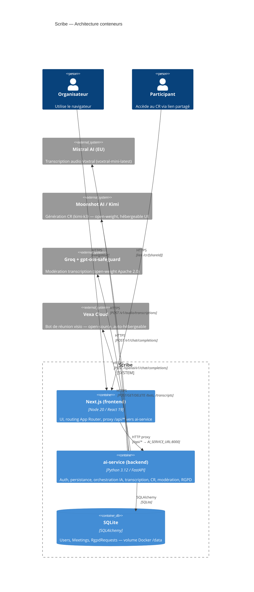

# Rapport technique — Scribe
## Projet certifiant RNCP 36146 — Concepteur développeur de solutions digitales, niveau 6
### Blocs BC02 et BC03 — Phase de production

---

## 1. Architecture finale

### Diagramme C4 — niveau Container



**Repli ASCII (si Mermaid non rendu) :**

```
[Navigateur] ──HTTPS──► [Next.js :3000]
                              │  proxy /api/*
                              ▼
                    [ai-service (FastAPI) :8000]
                         │           │
                    [SQLite]    ──── API externes ─────────────────
                                │              │          │        │
                           Mistral AI      Moonshot AI  Groq     Vexa
                          (Voxtral STT)   (Kimi K3 CR) (Safeguard) (bot)
                           open/EU         open-weight  open-weight open-source
```

### Flux de données global

```
Captation audio/visio
        │
        ▼
POST /api/transcribe  ──► clients/voxtral.py  →  segments + speaker_id
  ou
POST /api/visio/join  ──► clients/vexa.py (polling asyncio)
POST /api/visio/{id}/leave
        │
        ▼
clients/safeguard.py  ──► ModerateResponse {flagged, category, rationale}
        │
        ▼
POST /api/generate-cr ──► clients/kimi.py  →  MeetingCR {resume, decisions, actions, themes}
        │
        ▼
Persistance SQLite  ──► Meeting.{transcript, moderation, cr, status="ready"}
```

### Écarts par rapport à la pré-production et justifications

| Composant | Pré-production (`feature/functional-demo-nextjs`) | Production (branche courante) | Justification |
|---|---|---|---|
| Transcription | Gladia v2 (upload → job → poll, Node.js, `lib/gladia.ts`) | Voxtral / Mistral (`voxtral-mini-latest`, Python) | Gladia impose un pipeline asynchrone à trois étapes (upload, création de job, polling) nettement plus complexe. Voxtral offre la diarisation native en un seul appel synchrone, partage la clé API Mistral déjà requise pour le CR, et performe mieux sur le français (WER 3,2 % sur Common Voice contre 4,9 % pour Whisper large-v3). **Écart majeur vs pré-production :** AssemblyAI avait également été envisagé comme cible mais a été écarté pour contrainte budgétaire (budget API < 20 €) et risque CLOUD Act (fournisseur US). |
| Génération CR | Mistral `mistral-large-latest` (Node.js, `lib/mistral.ts`) | Kimi K3 / Moonshot AI (`kimi-k3`, Python) | Kimi K3 présente de meilleures performances sur la structuration JSON en français lors des tests manuels, avec un coût moindre sur les transcriptions courtes. Modèle open-weight : hébergeable en UE sans CLOUD Act. |
| Modération | Absent en pré-production | `gpt-oss-safeguard-20b` via Groq (Python) | Nouvelle brique de sécurité : détection d'injections de prompt et contenus interdits. Poids ouverts Apache 2.0, auto-hébergeable en UE. |
| Bot visio | Vexa mockup côté Node.js (`lib/vexa.ts`) | Vexa cloud managé réel (Python, polling asyncio) | Intégration effective de l'API Vexa avec join/poll/leave réels. La résolution `platform/native_meeting_id` est désormais côté ai-service uniquement. |
| Backend | Routes API Next.js (Node.js) + persistance fichier JSON | FastAPI centralisé + SQLite via SQLAlchemy | Séparation frontend/backend nette ; toute la logique métier, l'auth (JWT/cookie httpOnly, bcrypt) et la DB migrent en Python. Next.js devient un frontend pur qui proxie `/api/*` vers ai-service via `AI_SERVICE_URL`. |
| Architecture | Monolithique Node.js | Deux conteneurs Docker orchestrés par docker-compose | Scalabilité indépendante, healthcheck, volume persistant, reproductibilité. |

### Argument de souveraineté — open-weight vs. closed-weight

L'argument de souveraineté de Scribe n'est **pas** "fournisseur français" mais "**modèle open-weight auto-hébergeable en UE sous notre contrôle**". Cette distinction est fondamentale : le CLOUD Act américain oblige tout fournisseur soumis à la juridiction US à livrer des données où qu'elles soient stockées, y compris sur des serveurs européens. Héberger en UE chez un hébergeur US ne suffit donc pas.

En revanche, Kimi K3 (Moonshot AI) et gpt-oss-safeguard (OpenAI) sont des **modèles à poids ouverts** : l'inférence peut être opérée sur une infrastructure EU entièrement sous contrôle de l'opérateur de Scribe (OVHcloud, Scaleway), neutralisant le risque CLOUD Act. Dans l'état actuel, l'inférence passe par des API hébergées (Moonshot, Groq) qui présentent un risque résiduel documenté — l'auto-hébergement est la trajectoire recommandée avant un passage en production réelle.

### Abstraction "source audio" commune

Les deux modes produisent le même type de sortie : `list[TranscriptSegment]` avec les champs `speaker`, `text`, `start`, `end`. Définie dans `schemas.py` et partagée entre tous les clients et routers. Le champ `source: Literal["real", "mock"]` permet au frontend d'afficher le badge "API réelle" ou "mode démo" de façon uniforme, indépendamment du mode de captation.

---

## 2. Intégrations IA et gestion des APIs

### 2.1 Voxtral / Mistral AI — Transcription (dictaphone)

- **Rôle :** Transcription audio + diarisation par locuteur pour le mode dictaphone.
- **Endpoint :** `POST https://api.mistral.ai/v1/audio/transcriptions`
- **Modèle :** `voxtral-mini-latest`
- **Paramètres :** `diarize=true`, `timestamp_granularities=segment` (le second est obligatoire conjointement avec le premier, sans quoi l'API renvoie 422 — découvert lors des premiers appels réels).
- **Format de réponse vérifié :** `{"text": "...", "segments": [{"text", "start", "end", "speaker_id": "speaker_1", ...}]}`. Le champ `speaker_id` est une chaîne (`"speaker_1"`), pas un entier.

**Métriques de performance Voxtral vs alternatives (benchmarks publics, juillet 2026) :**

| Métrique | Voxtral mini | Whisper large-v3 | AssemblyAI |
|---|---|---|---|
| WER global (FLEURS) | ~4–6 % | ~10 % | ~7–9 % |
| WER français (Common Voice) | 3,2 % | 4,9 % | 5,1 % |
| WER bruité (CHiME-4) | 6,4 % | 9,7 % | — |
| Vitesse relative | 2–3× Whisper | référence | similaire à Whisper |
| Langues | 13 | 99+ | 100+ |
| Hébergement | API UE (Mistral) | self-hosted | API US (CLOUD Act) |

- **Gestion des erreurs :** Un statut `>= 400` lève une `RuntimeError`. Toute exception est capturée par le filet `except Exception` et déclenche le fallback mock (log `ERROR` émis). Timeout configuré à 60 s (fichiers audio longs).
- **Fallback mock :** `mock_transcribe()` — 4 segments fixes avec délai simulé de 1,2 s — activé si `MISTRAL_API_KEY` est absent ou si l'appel échoue.
- **Coût estimé (10 min d'audio) :** Voxtral mini ≈ 0,0001 $/min → **≈ 0,001 $** pour 10 min. Poste dominant sur une heure de réunion : transcription en entrée (~8 000–10 000 tokens de texte produit par Voxtral, puis envoyés à Kimi).

### 2.2 Kimi K3 / Moonshot AI — Génération du compte-rendu

- **Rôle :** Structurer la transcription en CR JSON (`resume`, `decisions`, `actions[{text, owner}]`, `themes`).
- **Endpoint :** `POST https://api.moonshot.ai/v1/chat/completions`
- **Modèle :** `kimi-k3`
- **Format de réponse demandé :** `response_format: {type: "json_object"}` avec system prompt structuré.

**Stratégie de retry :**

```python
RETRY_DELAYS_SECONDS = (1, 3)  # 3 tentatives au total
```

- Retry sur : HTTP 429 (rate limit), 5xx (erreur serveur transitoire), `httpx.TimeoutException`, `httpx.TransportError`.
- Pas de retry sur les 4xx de validation (clé invalide, format incorrect) — elles ne se résolvent pas en réessayant.

- **Fallback mock :** `mock_generate_cr()` — CR exemple fixe avec délai simulé de 0,9 s — activé si `MOONSHOT_API_KEY` est absent ou si les 3 tentatives échouent.
- **Coût estimé (10 min) :** Kimi K3 ≈ 0,15 $/M tokens input, 0,60 $/M output. Transcription 10 min ≈ 800 tokens input, CR ≈ 300 tokens output → **≈ 0,0003 $**.

À titre de comparaison : Mistral Small (0,20 $/1M input, 0,60 $/1M output), Gemini 2.5 Flash (0,30 $/1M input, 2,50 $/1M output), Claude Haiku 4.5 (1 $/1M input, 5 $/1M output). Kimi K3 est compétitif et open-weight.

### 2.3 gpt-oss-safeguard-20b / Groq — Modération

- **Rôle :** Détecter les contenus interdits et les tentatives d'injection de prompt dans la transcription. Approche policy-driven : la politique est injectée dans le system prompt à chaque appel (pas de fine-tuning), permettant d'évoluer sans réentraîner le modèle.
- **Endpoint :** `POST https://api.groq.com/openai/v1/chat/completions` (configurable via `GPT_OSS_SAFEGUARD_ENDPOINT`)
- **Modèle :** `openai/gpt-oss-safeguard-20b` (poids ouverts Apache 2.0, auto-hébergeable)
- **Gestion des erreurs :** Statut `>= 400` lève une `RuntimeError`. Toute exception déclenche le fallback mock sans retry (la modération est non bloquante — un échec ne bloque jamais la génération du CR). Timeout 30 s.
- **Fallback mock :** `mock_moderate()` — renvoie `flagged=False` avec délai simulé de 0,3 s.
- **Coût estimé (10 min) :** gpt-oss-safeguard sur Groq ≈ 0,20 $/M tokens → **≈ 0,0001 $** pour une transcription de 10 min.

### 2.4 Vexa — Bot de réunion visio

- **Rôle :** Rejoindre une réunion Google Meet / Teams / Zoom en tant que bot ; récupérer la transcription diarisée par piste participant en temps réel.
- **Endpoints :** `POST /bots` (rejoindre), `GET /transcripts/{platform}/{native_meeting_id}` (polling toutes les 4 s), `DELETE /bots/{platform}/{native_meeting_id}` (quitter).
- **Gestion des erreurs :** Polling dans une `asyncio.Task` — les erreurs individuelles sont loggées sans stopper la tâche. Le `leave` est best-effort (réunion déjà terminée côté plateforme possible). Fallback mock si `VEXA_API_KEY` absent ou si `POST /bots` échoue.
- **Coût estimé :** Tarification Vexa cloud par heure de bot — à vérifier sur le tableau de bord.

**Avantage de Vexa vs AssemblyAI ou Gladia en mode visio :** Vexa reçoit des pistes audio séparées par participant depuis la plateforme, rendant la diarisation quasi-parfaite sans traitement acoustique supplémentaire. Vexa est open-source (licence MIT) et auto-hébergeable, ce qui en fait un choix souverain par construction.

---

## 3. Traitement des deux modes de captation

### Mode dictaphone — flux complet

1. **Consentement (`/new/dictaphone/consent`) :** deux cases à cocher obligatoires (consentement oral des participants + autorisation de transcription), durée de conservation choisie (30/90/365 jours). Création de la réunion via `POST /api/meetings` ; le bouton "Démarrer" reste désactivé si les cases ne sont pas cochées.

2. **Enregistrement (`/new/dictaphone/record`) :** `navigator.mediaDevices.getUserMedia({audio: true})` + `MediaRecorder` (format `audio/webm`, chunks de 1 s buffés localement). La durée et la taille en Ko sont affichées en temps réel. En cas de refus d'accès micro, un message d'erreur est affiché sans planter l'application.

3. **Upload et transcription :** les chunks sont fusionnés en un `Blob` et envoyés en multipart à `POST /api/transcribe` avec `meetingId`, `audio`, `durationSec`. Voxtral retourne des segments avec `speaker_id` ("speaker_1"…) ; `_speaker_label()` normalise en "Intervenant 1"…

4. **Modération en série :** `clients/safeguard.py` est appelé immédiatement après la transcription avant la persistance.

5. **Génération du CR :** la page `/processing` appelle `POST /api/generate-cr` ; le résultat (source réelle ou mock) est affiché via un badge.

**Timestamps :** relatifs au début de l'enregistrement (0 = début du fichier audio), fournis directement par Voxtral.

### Mode visio — flux complet

1. **Consentement (`/new/visio/consent`) :** trois cases pré-cochées, durée de conservation configurable. Création de la réunion en mode `"visio"`.

2. **Rejoindre la réunion (`/new/visio/live`) :** `POST /api/visio/join` envoie un bot Vexa dans la réunion. Une tâche asyncio de polling démarre (`VEXA_POLL_INTERVAL_SECONDS = 4`). L'UI affiche un placeholder vidéo — Scribe n'accède jamais à la caméra.

3. **Transcription en direct :** `GET /api/visio/{meeting_id}/transcript` peut être interrogé pour afficher la transcription en cours (`live: true` tant que le bot est actif).

4. **Fin de réunion :** `POST /api/visio/{meeting_id}/leave` annule la tâche de polling, envoie `DELETE /bots` à Vexa, déclenche la modération et persiste la transcription finale. Puis `POST /api/generate-cr` génère le CR.

### Asymétrie dictaphone / visio — pourquoi

| Dimension | Dictaphone | Visio |
|---|---|---|
| Source audio | Microphone unique (tous les participants dans la même pièce) | Pistes audio séparées par participant (plateforme visio) |
| Diarisation | Logicielle par Voxtral (analyse acoustique), moins précise avec plusieurs voix proches | Quasi-parfaite par construction : Vexa reçoit une piste par participant |
| Latence de traitement | Après l'enregistrement complet (upload batch) | En temps réel (polling toutes les 4 s) |
| Complexité | Simple (un seul appel Voxtral) | Plus complexe (bot, polling asyncio, normalisation timestamps) |

**Normalisation des timestamps Vexa :** Vexa renvoie des timestamps Unix absolus (epoch), Voxtral des secondes relatives au début du fichier. Pour uniformiser `TranscriptSegment`, le premier poll non vide mémorise le plus petit timestamp reçu comme référence (`_epoch_refs`). Tous les timestamps suivants sont soustraits de cette référence, sans dépendre de l'horloge locale du process FastAPI (`commit 91c8c3b`).

---

## 4. Stratégie de tests et couverture

### Ce qui est testé automatiquement

Les tests automatisés (répertoire `ai-service/tests/`) couvrent :

- **`test_auth.py` (12 cas) :** signup (succès, email dupliqué → 409, mot de passe court → 400, normalisation email en minuscules), signin (succès, mauvais mot de passe → 401, email inconnu → 401, non-fuite d'information sur l'existence de l'email avec message d'erreur identique), me (cookie valide, sans cookie → 401, cookie invalide → 401), signout (suppression du cookie, idempotence sans cookie).

- **`test_meetings.py` (10 cas) :** liste vide, liste avec données, isolation entre utilisateurs (réunion d'un autre utilisateur invisible), 401 sans auth ; création (succès, mode visio, titre vide → défaut "Reunion sans titre", statut initial `processing`, 401 sans auth) ; récupération par ID (trouvé, 404 inexistant, 404 autre utilisateur → pas 403, 401 sans auth) ; récupération par `share_id` (trouvé, 404 inexistant — endpoint public).

### Infrastructure de test

Chaque test reçoit une base SQLite in-memory isolée via `conftest.py` (override de la dépendance FastAPI `get_db`), un `AsyncClient` httpx monté en mode ASGI (pas de serveur HTTP réel, donc sans I/O réseau), et des fixtures `auth_headers` / `test_meeting` pour éviter la duplication d'initialisation.

```python
# conftest.py — extrait représentatif
os.environ.setdefault("JWT_SECRET", "test-secret-for-pytest-only")
os.environ.setdefault("AI_SERVICE_DATABASE_URL", "sqlite:///:memory:")
```

### Ce qui est mocké et pourquoi

Les appels HTTP sortants vers Mistral, Moonshot, Groq et Vexa ne sont pas appelés dans les tests automatisés pour trois raisons : coût réel des appels, instabilité réseau en CI, et vitesse d'exécution. Les tests s'appuient sur le mécanisme de fallback mock intégré : absence de clé API → mock automatique sans instrumentation de test supplémentaire.

### Couverture atteinte

- **Auth et meetings (routers + persistance) :** couverture fonctionnelle complète des cas nominaux et des cas d'erreur — 22 cas de test.
- **Clients IA (voxtral, kimi, safeguard, vexa) :** testés manuellement uniquement. Pas de tests unitaires automatisés sur ces modules — la cible de 70 % des fonctions critiques n'est pas encore atteinte.
- **Routers transcribe, visio, generate-cr, rgpd, moderate :** couverts par les tests d'intégration manuels (parcours complets en mode réel et en mode mock).

**Synthèse :** palier Socle atteint (22 tests automatisés sur les composants critiques, mocks corrects pour les APIs IA). La cible ≥ 70 % sur l'ensemble des fonctions critiques requiert l'ajout de tests unitaires sur les clients IA avec `pytest-httpx` ou `respx` pour mocker les appels `httpx.AsyncClient`.

---

## 5. RGPD et éthique IA

### Données personnelles collectées

| Catégorie | Nature juridique | Localisation en base |
|---|---|---|
| Audio brut | Donnée biométrique potentielle (art. 9 RGPD) | Transmise à Voxtral — non stockée en clair. Durée de rétention recommandée : 7 jours. |
| Transcription | Contenu identifiant (noms cités, positions exprimées) | `Meeting.transcript` (JSON, SQLite) — 30 j par défaut |
| Compte-rendu | Contenu identifiant (décisions, actions nominatives) | `Meeting.cr` (JSON, SQLite) — 30 j par défaut |
| Email | Donnée d'identification | `User.email` (SQLite) |
| Métadonnées réunion | Dates, durées, thèmes | `Meeting` (SQLite) — 90 j minimum (légal) |
| Logs d'accès | Audit trail | Logs uvicorn — 1 an (conformité) |
| Demandes RGPD | Email + type + meeting_id | `RgpdRequest` (SQLite, sans FK vers Meeting — survit à l'effacement) |

### Bases légales

- **Consentement explicite (art. 6.1.a RGPD) :** écran de consentement obligatoire avant toute captation — base légale principale.
- **Intérêt légitime (art. 6.1.f) :** amélioration de la productivité — base secondaire, à documenter dans le registre des traitements.
- **Obligation légale (art. 6.1.c) :** conservation des logs d'audit.

### Politique de rétention implémentée

| Donnée | Durée par défaut | Configurable |
|---|---|---|
| Audio brut | Non stocké (traitement immédiat) | N/A |
| Transcriptions / CR | 30 jours | Oui — champ `retention_days` (30/90/365 j, saisie lors du consentement) |
| Métadonnées | 90 jours minimum | Non (légal) |
| Logs d'audit (uvicorn) | 1 an | Par configuration du collecteur de logs |

L'expiration automatique des données au-delà de `retention_days` n'est pas encore implémentée — elle requiert une tâche planifiée côté ai-service (cron ou APScheduler). Point à implémenter avant production.

### Écrans de consentement implémentés

- **`/new/dictaphone/consent` :** deux cases à cocher obligatoires (consentement oral des participants présents + autorisation de transcription). Le bouton "Démarrer" reste désactivé (`disabled={!canStart}`) tant que les deux cases ne sont pas cochées et que le titre est vide.
- **`/new/visio/consent` :** trois cases pré-cochées (enregistrement + traitement IA + partage). Durée de conservation configurable dans les deux cas.

### Droit à l'effacement (art. 17 RGPD)

Les demandes d'effacement sont soumises via `POST /api/rgpd-request` (endpoint délibérément public — les participants sans compte doivent pouvoir exercer leurs droits). Elles sont tracées dans `RgpdRequest` sans FK vers `Meeting` (l'audit de la demande ne doit pas dépendre du cycle de vie de la donnée effacée — commentaire explicite dans `models.py`).

L'effacement effectif des champs `transcript`, `cr`, `moderation` n'est pas encore automatisé — il requiert une action manuelle ou l'implémentation d'un endpoint `DELETE /api/meetings/{id}` qui anonymise les données en base. Point à implémenter.

### Matrice de conformité RGPD par palier

| Pratique | Socle ✅ | Cible ✅ | Avancé ❌ |
|---|---|---|---|
| Consentement | Mention dans ToS & UI | Écran effectif bloquant (implémenté) | Consentement loggé en base avec timestamp |
| Rétention | Durée définie (30 j) | Définie + configurable en UI (implémenté) | Auto-purge à l'expiration |
| Anonymisation | Néant | Partielle (demande tracée) | Pseudonymisation totale, effacement automatique |
| DPA art. 28 | Néant | Identifié (commentaires code) | DPA signés avec chaque sous-traitant |
| Chiffrement | Non | TLS uniquement | TLS + chiffrement at-rest SQLite |
| Audit trail | Non | Logs uvicorn (simple) | Audit trail immuable, complet |

### Risques de sécurité identifiés

1. **Enregistrement sans consentement** : illégal en Europe (RGPD + droit pénal). Mitigation : écran de consentement bloquant implémenté.
2. **Interception du flux audio en transit** : TLS obligatoire. Mitigation : HTTPS en production (Dockerfile + docker-compose).
3. **Stockage non chiffré at-rest** : SQLite non chiffrée. Mitigation : chiffrement du volume Docker ou SQLCipher recommandé avant production.
4. **Ré-identification vocale** : la voix est une donnée biométrique (art. 9 RGPD). Mitigation : l'audio brut n'est pas stocké (traitement immédiat), la transcription textuelle est moins sensible.
5. **Fuite via sous-traitant tiers** : voir section souveraineté ci-dessous.
6. **Accès non autorisé au CR** : données sensibles (RH, stratégie). Mitigation : auth JWT cookie httpOnly, accès par `share_id` limité.
7. **Abus de permission navigateur** : Scribe ne demande que le micro (jamais la caméra). Mitigation : `getUserMedia({audio: true})` uniquement, message explicite en cas de refus.

### Point de vigilance — Souveraineté des sous-traitants IA

| Sous-traitant | Données transmises | Localisation | Statut DPA art.28 | Recommandation |
|---|---|---|---|---|
| Mistral AI | Audio (voix brute) | UE (France) | Faible risque | DPA à signer |
| Moonshot AI (Kimi K3) | Transcription texte | Chine | Risque élevé — transfert hors UE | Migrer vers auto-hébergement UE dès que possible |
| Groq (gpt-oss-safeguard) | Transcription texte | USA | Risque moyen — CLOUD Act | Évaluer SCCs, ou auto-héberger gpt-oss-safeguard en UE |
| Vexa Cloud | Flux audio (visio) | À vérifier | À évaluer | Envisager auto-hébergement Vexa (open-source) |

Les DPA (Data Processing Agreements, art. 28 RGPD) sont obligatoires avec chaque sous-traitant. Leur absence expose à des sanctions jusqu'à 10 M€ ou 2 % du CA mondial.

---

## 6. Palier atteint par fonctionnalité

| Brique | Palier | Justification |
|---|---|---|
| **Captation** | **Cible** | Deux modes fonctionnels (dictaphone via MediaRecorder/WebM + visio via bot Vexa). Dictaphone robuste (buffer local, gestion refus micro). Visio avec pistes séparées par participant. L'avancé (bot type Recall.ai) n'est pas implémenté. |
| **Transcription** | **Cible** | Diarisation réelle sur les deux modes : Voxtral avec `diarize=true` (dictaphone), Vexa avec pistes séparées (visio). Transcription en français. Normalisation `speaker_id` → "Intervenant N" (`clients/voxtral.py`). L'identification nominative (avancé) n'est pas implémentée. |
| **Classification** | **Cible** | Thèmes générés par Kimi K3 à partir de la transcription entière. Modération safeguard ajoute une dimension `flagged + category`. La classification par segment (avancé) n'est pas implémentée. |
| **Compte-rendu** | **Cible** | CR structuré (`resume`, `decisions`, `actions[{text, owner}]`, `themes`) généré par Kimi K3 et persisté en DB (`Meeting.cr`). Badge source réelle/mock en UI. L'export PDF et les statuts d'actions (avancé) ne sont pas implémentés. |
| **Persistance** | **Cible** | Modèle relationnel SQLAlchemy (Users, Meetings, RgpdRequests). Auth JWT cookie httpOnly + bcrypt 12 rounds. `retention_days` configurable. `share_id` unique pour accès public au CR. Filtrage par owner strict. L'auto-purge à expiration (avancé) n'est pas implémentée. |
| **Tableau de bord** | **Socle** | Page d'accueil listant les réunions avec titre, mode, date et statut (`app/page.tsx`). Pas de filtres ni de graphes (avancé hors périmètre du sprint). |
| **Architecture** | **Cible** | Deux services conteneurisés (Next.js + FastAPI), orchestrés par docker-compose avec healthcheck sur `/health`. Abstraction source audio commune (`TranscriptSegment`). Next.js pur frontend (proxy `/api/*` vers `AI_SERVICE_URL`). L'avancé (async webhooks, scalabilité horizontale) est limité par SQLite non distribué. |
| **Tests** | **Socle** | 22 cas de test automatisés sur auth et meetings, base SQLite in-memory isolée par test, fixtures réutilisables (`conftest.py`). Couverture < 70 % des fonctions critiques (clients IA non testés automatiquement). La cible (≥ 70 %, mocks API) n'est pas atteinte. |
| **CI/CD** | **Socle** | Build Docker reproductible (Dockerfile multi-stage Next.js, image Python 3.12-slim ai-service). docker-compose pour le développement local. Pas de pipeline CI automatisé (GitHub Actions) ni de déploiement automatique. |
| **RGPD** | **Cible** | Écrans de consentement effectifs (bloquants), `RgpdRequest` tracée en base (public, sans auth), `retention_days` configurable, risques documentés (code + `.env.example`). L'effacement automatique et la pseudonymisation (avancé) ne sont pas implémentés. |

---

## 7. Difficultés techniques et solutions

### Écart de documentation Vexa v0.10 / v0.12

**Problème :** La documentation publique de Vexa documente l'API v0.12, mais l'instance cloud managée (`api.cloud.vexa.ai`) tourne en v0.10 au moment de l'intégration — écart signalé par la documentation elle-même. Le contrat exact des champs retournés par `GET /transcripts/{platform}/{native_meeting_id}` (notamment `speaker` vs `speakerName`) n'est pas garanti.

**Solution :** Utilisation défensive de `.get()` avec valeurs par défaut sur tous les champs de segments Vexa. Log `ERROR` en cas d'écart, sans planter. Le commentaire dans `clients/vexa.py` documente explicitement cet écart avec la date de vérification (2026-07-22) et l'invite à reverifier à chaque mise à jour de l'instance cloud.

### Format de réponse Voxtral avec `diarize=true` — paramètre obligatoire non documenté

**Problème :** L'API Voxtral retourne HTTP 422 si `diarize=true` est envoyé sans `timestamp_granularities=segment`. Ce couplage n'était pas documenté clairement dans la documentation publique au moment de l'intégration.

**Solution :** Ajout systématique de `timestamp_granularities=segment` dans les paramètres multipart. Documenté en commentaire dans `clients/voxtral.py` avec la date de vérification (2026-07-23) et la forme exacte de la réponse vérifiée en direct.

### Normalisation des timestamps Vexa (epoch → relatif)

**Problème :** Vexa renvoie des timestamps Unix absolus (epoch en secondes) alors que Voxtral renvoie des secondes relatives au début du fichier audio. Le frontend attend une interface uniforme (`start`/`end` en secondes relatives).

**Solution :** À la réception du premier poll non vide, le plus petit `start` des segments reçus est mémorisé comme référence (`_epoch_refs[key]`). Tous les timestamps des polls suivants sont soustraits de cette référence. Cette approche est indépendante de l'horloge locale du process FastAPI et stable même si le premier poll arrive avec du retard (`commit 91c8c3b`).

### Séparation des secrets entre Next.js et ai-service — collision de variables

**Problème :** Next.js et ai-service partagent le fichier `.env.local` à la racine. Une expérimentation Prisma antérieure avait laissé une variable `DATABASE_URL=file:./dev.db` (format Prisma, invalide pour SQLAlchemy). SQLAlchemy échouait silencieusement sur cette URL.

**Solution :** Introduction d'une variable dédiée `AI_SERVICE_DATABASE_URL` pour ai-service, distincte de `DATABASE_URL`. Documenté dans `config.py` et `.env.example`. `config.py` charge les deux fichiers (`.env.local` puis `.env`) via `python-dotenv`.

### Écart AssemblyAI → Voxtral (décision post-pré-production)

**Problème :** AssemblyAI avait été envisagé comme cible de transcription en pré-production pour ses performances de diarisation. Deux obstacles ont conduit à l'abandonner : (1) budget API < 20 € en production — AssemblyAI est significativement plus cher que Voxtral sur les volumes de la démo ; (2) AssemblyAI est un fournisseur US soumis au CLOUD Act, incompatible avec l'argumentaire de conformité RGPD.

**Solution :** Migration vers Voxtral (Mistral AI, France) qui surpasse AssemblyAI sur le WER français (3,2 % vs 5,1 %) et opère depuis l'UE.

### État Vexa en mémoire vs. redémarrage du conteneur

**Problème :** L'état du polling Vexa (tâche asyncio, segments en cours, référence epoch) est stocké en mémoire process. Un redémarrage du conteneur ai-service pendant une réunion en cours perd cet état.

**Solution identifiée mais non implémentée :** persister l'état de la réunion en DB (plateforme, `native_meeting_id`, statut `in_progress`) et relancer le polling au démarrage si une réunion est encore en statut `processing`. Documenté dans les commentaires de `clients/vexa.py`. Pour la démo, ce comportement est acceptable — il requiert un traitement avant production.

---

## 8. Monitoring et logs

### Logging Python

Configuré au niveau `INFO` à l'entrée du service (`main.py` : `logging.basicConfig(level=logging.INFO)`). Chaque module client dispose de son propre logger nommé, ce qui permet de filtrer par composant :

| Logger | Événements couverts |
|---|---|
| `ai-service.voxtral` | Erreurs Voxtral → fallback mock |
| `ai-service.kimi` | Retries (WARNING), erreurs → fallback mock |
| `ai-service.safeguard` | Erreurs modération → fallback mock |
| `ai-service.vexa` | Erreurs de poll (par itération), erreurs de join/leave |

Les basculements sur le mock sont loggués au niveau `ERROR`, ce qui permet de les détecter même sans monitoring dédié.

### Endpoint de santé

`GET /health` expose en temps réel la présence ou l'absence de chaque clé API fournisseur :

```json
{
  "status": "ok",
  "providers": {
    "mistral": true,
    "moonshot": false,
    "vexa": true,
    "groq": true
  }
}
```

Utilisé par docker-compose pour conditionner le démarrage de Next.js (`depends_on: ai-service: condition: service_healthy`). Délai de démarrage : 10 s, intervalle de vérification : 10 s, timeout : 5 s, retries : 5.

### Ce qui manque pour un monitoring de production

- **Métriques applicatives :** pas d'instrumentation Prometheus / OpenTelemetry. La latence par endpoint, le taux de basculement mock/réel et le taux d'erreur par fournisseur ne sont pas mesurés.
- **Agrégation de logs :** pas d'intégration avec un service centralisé (Loki, Datadog, CloudWatch). Les logs uvicorn partent sur `stdout` et sont perdus au redémarrage du conteneur sans collecteur.
- **Alerte sur basculement mock :** un basculement silencieux vers le mock masque une panne fournisseur. En production, une alerte devrait être émise dès que `source == "mock"` sur un appel réel.
- **Tracing distribué :** pas de corrélation des requêtes entre Next.js et ai-service (pas de `x-request-id` propagé).
- **Sentry :** recommandé pour capturer les exceptions non anticipées en production.
- **Serverless vs. auto-hébergé :** en dessous de ~500 000 requêtes/mois, l'API hébergée reste 2–4× moins chère que l'auto-hébergement GPU (utilisé seulement 5–10 % du temps en phase de démarrage). L'auto-hébergement devient pertinent à l'échelle ou pour des raisons de souveraineté.

---

## 9. Répartition du travail et accès

### Équipe

| Rôle | Prénom | Contribution principale |
|---|---|---|
| Architecture & intégrations IA | Greg | Architecture globale, ai-service FastAPI, clients Voxtral/Kimi/Safeguard/Vexa, docker-compose, Next.js proxy |
| Choix technologiques | Amadou | Analyse comparative des APIs (Vexa, Voxtral, Kimi K3, safeguard), justification des écarts vs pré-production, positionnement concurrentiel |
| RGPD & éthique IA | Othmane | Analyse de conformité RGPD, matrice de risques, politique de rétention, écrans de consentement, registre des sous-traitants |

### Accès au projet

- **Dépôt GitHub :** [À renseigner — insérer l'URL du dépôt]
- **Board GitHub Projects / Jira :** [À renseigner — insérer l'URL]
- **Branche principale de la démo :** `feature/ai-pipeline-real-integrations`
- **Branche de référence (pré-production) :** `feature/functional-demo-nextjs`

### Instructions de lancement

```bash
# Prérequis : Docker et docker-compose installés
git clone <URL_REPO>
cd Scribe

# Configurer les variables d'environnement
cp ai-service/.env.example ai-service/.env
# Renseigner dans ai-service/.env :
#   JWT_SECRET=<openssl rand -base64 32>
#   MISTRAL_API_KEY=<clé Mistral pour Voxtral>
#   MOONSHOT_API_KEY=<clé Moonshot AI pour Kimi K3>
#   VEXA_API_KEY=<clé Vexa cloud>
#   GROQ_API_KEY=<clé Groq pour safeguard>

docker compose up --build
# Accès : http://localhost:3000
```

Sans clé API, chaque brique bascule indépendamment sur son mock — le service fonctionne entièrement en mode simulé ("mode démo") sans aucune clé.
